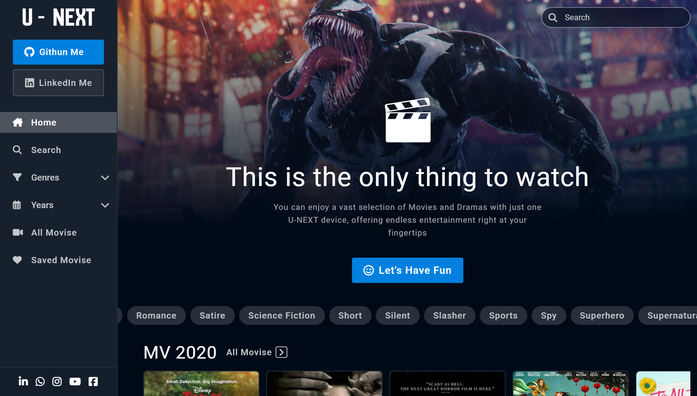

<h1 align="center">U-NEXT</h1>

You can enjoy a vast selection of Movies and Dramas with just one U-NEXT device, offering endless entertainment right at your fingertips.

<h1 align="left">Skills:</h1>

  
  
  
  
  
  

<h2>Demo Shots:</h2>
